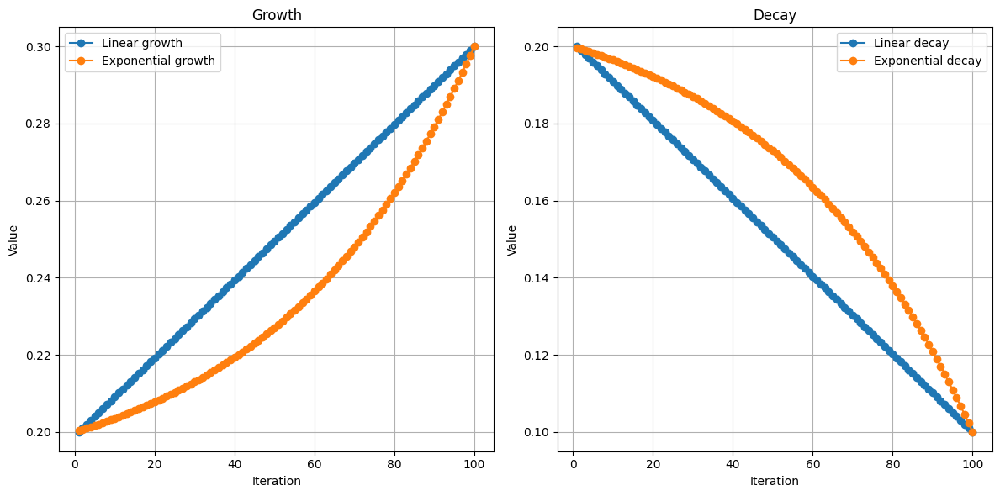
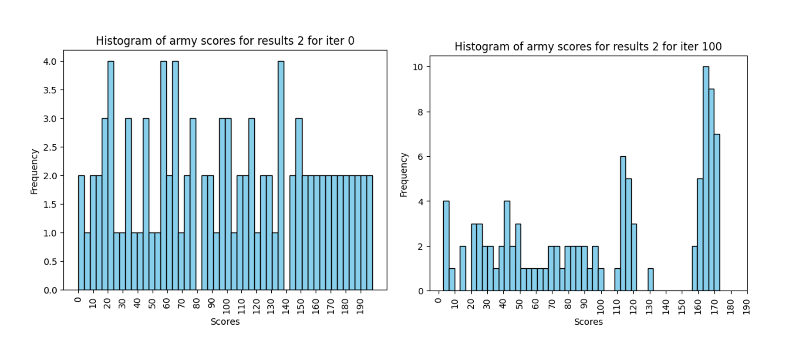
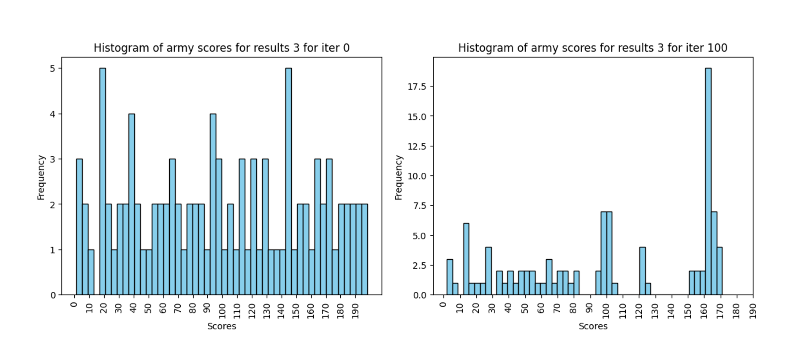
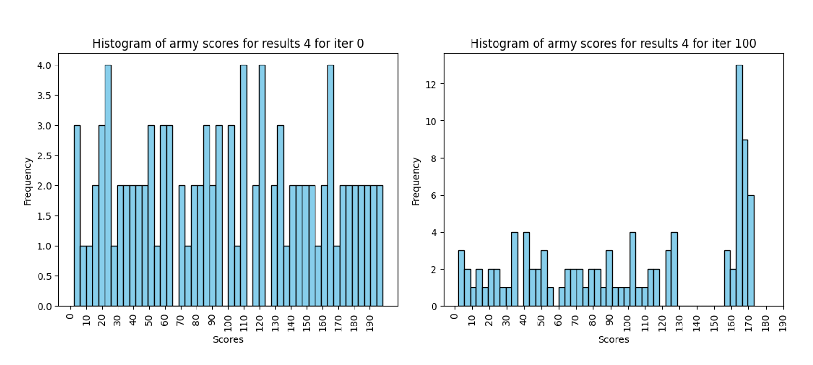

# War Simulator

Author: Victor Manuel Cardentey Fundora

Institution: MATCOM-UH

## Metaheuristic selection

I selected a genetic algorithm approach to optimize the army according to the following reasoning.

1. The evaluation function is non-objective and non-deterministic, as it depends on the matches against other armies and the results are influenced by random factors such as the critical hit chance and the dice rolls.
1. "Survival of the strongest" seems like a fitting principle for a game about wars.
1. Evaluating armies by facing them agains each other within the same population could increase the efficiency of evaluation since every match evaluates two of the armies in the population. 
1. Combining armies seems like a fast and easy approach of exploring the search espace compared to only search in the neighborhood of the solution.

I know these reasons don't have any strong proof behind them but we are using metaheuristics anyway.

## Algorithm adaptation

#### Rates

- The **survival rate** represents the percentage of top armies that survive and directly advance to the next iteration of the population. Is defined as $\alpha_s \in [0.2, 0.3]$ which starts at the minimun value (prioratizing exploration) and increases in later iterations (prioratizing exploitation).
- The **reproduction rate** represents the amount of population of the next iteration that is produced by combining two existent solutions. Is defined as $\alpha_r \in [0.4, 0.5] $ which starts at the minimun value (prioratizing exploration) and increases in later iterations (prioratizing exploitation since it should reuse already known good traits). 
- The **mutation rate** represents the amount of population of the next iteration that is produced by mutating an existent solution. Is defined as $\alpha_m \in [0.1, 0.2]$ which start at the maximum value (prioratizing exploration) and decreases in later iterations (prioratizing exploitation).
- The **innovation rate** represents the amount of population of the next iteration that is produced randomly. Is defined as $\alpha_i \in [0.1, 0.2]$ which start at the maximum value (prioratizing exploration) and decreases in later iterations (prioratizing exploitation). I don't reduce this to 0 in later stages since I want to search for edge cases, these are armies that could beat my best army but they are not consistent against other armies. 

#### Army Evaluation

Since the evaluation of a given army depends of the armies it faces it's impossible to compute its exact value since the amount of armies is exponential due to its combinatory nature.

Also is important to notice that due to the way the simulation is done the left army has priority to attack when the speed is the same, this could affect the strategies since high speed left armies with high damage could do an army wipe.

```python
attack_order = sorted(left_army + right_army, key=lambda u: u.speed, reverse=True)
```

I considered two possible approaches for evaluation:

- A **league tournament**: each pair of armies face each other a pair amount of times, the amount has to be pair so each one can be on the left and on the right the same number of times. The winner gains one point and the loser zero.
- An **elimination tournament**: Playoff style, best to an odd amount of games.

I selected a league tournament since I think this format is better for making sure that the population at the top of the leaderboard are the more consistent armies among that generation. Is widely known that the results of elimination tournaments are highly dependent on the matchups, although this could be solved by running multiple tournaments but this seems like a league with extra steps. Also for elimination tournaments we need an odd amount of evaluations so the one that gets more times to the left side could potentially be beneffited. 

#### Reproduction operator

Given two armies, $A$ and $B$, and a maximum cost $c$  we will compute a variation cost given by the formula $c_v = \lfloor \frac{c}{2} \cdot U(0,1)  \rfloor$.

Then we will randomly remove units from $A$ until:

- The cost of the removed units is greater than the variation cost
- The army is left without units

The we will randomly add units from $B$ to $A$ until

- The cost of the added $B$ units plus the remaining $A$ units is greater than $c$

#### Mutation operator

Given an army $A$ we will generate a random mutation coefficient $c_m = \frac{ length(A) \cdot U(0,1)}{2} $ and then generate a random value $\rho \in U(0,1)$ 

- If $\rho > 0.5$: we will take a random unit from $A$ and remove it, then for each type of unit we will get the most expensive version which cost does not exceed the cost of the removed unit and select a random one to replace it.
- If $\rho \leq 0.5$: we will swap two random units and repeat this process the amount of times given by $c_m$.

## Implementation details

#### Solution space

The solution space was characterized by the components of a solution, in this case the units. All possible valid units were precomputed, making all unit, weapon and armour combination and increasing the level until we hit the max cost, and assigned an integer as id. This mapping will also help to introduce taboo search strategies more easily.

#### Parameter adjustment

For parameter adjustment I compared a linear growth vs an exponential growth function for the range of the algorithm rates for 100 iterations. Using the plots of the functions I adjusted the $r$ parameter of the exponential growth to 1.02 for 100.

$linear = min\_x + (max\_x - min\_x) \times \frac{(i-1)}{(n-1)}$

$exponential = min\_x + (max\_x - min\_x) \times \frac{(r^i-1)}{(r^n-1)}$



## Results

The experiments took from 1 to 5 hours to finish (min: 1:23:30, max: 4:58:47), by analizing the results data the cause of this discrepancy is the army size of the different solutions. Since bigger armies make the simulation of the battle take longer.

To check for the convergence of the algorithm I plotted the histogram of the armies scores, we can see for each one of the experiment runs that the scores are almost evenly distributed in the beginning but the distribution shows clear elitism by the end. 







 